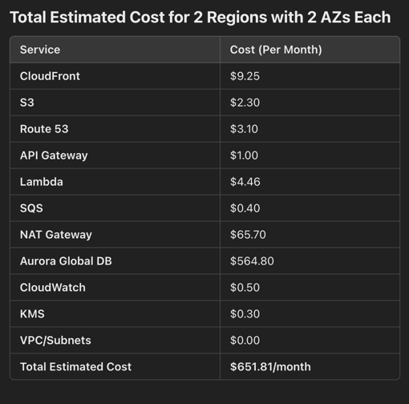

I want to first approach this with the principle of:
Simple is best
Address the quality attributes I desire.

https://aws.amazon.com/blogs/networking-and-content-delivery/latency-based-routing-leveraging-amazon-cloudfront-for-a-multi-region-active-active-architecture/
https://docs.aws.amazon.com/whitepapers/latest/best-practices-api-gateway-private-apis-integration/http-api.html

Therefore as first iteration, I want to design something that works and not overly complicate stuff.
Firstly let’s think about Functional and non-functional requirements. I don’t see any functional requirements in the problem except e-commerce platform, so non-functional will be : Multi-region, Highly available, Scalable, heavy loads, automatic scaling, load balancing, disaster recovery.

Start with some Architecture styles to choose from: Monolithic, micro services, event driven, severless (lambda). Keep some principles in mind like DRY and KISS. Since we have the non-functional requirements of highly available, scalable, heavy loads, let’s think what happens if use Monolithic. It is highly coupled meaning need to replicate the application across multi region (according to the NF requirements). It is not highly available and If crash, everything crash with single points of failure. It is not really scalable and vertical scaling is expensive, harder to handle heavy load as cant scale everything in the app so will have bottlenecks. Therefore choose Microservices (use Event driven Style or Choreography) so that it is easier to deploy services regionally (multi region), each service is independant isolating failures (highly available), you can scale horizontally instead of vertically (both scalable and heavy load), you can automatically scale each service, can load balance at service level and faster disaster recovery.

Lets design:
1) need a client that users connect to. Assume some front end website or some mobile app. For simplicity, I will assume this front end website is a static SPA application so that I can use S3 + CloudFront for cost efficiency, scalability, and global reach. Use multiple cloud front
2) Command API Gateway. This is for write request only (following CQRS).  This will handle all the commands coming from the front end client or mobile app and route it to the relevant micro services.

Some Microservices that can be designed can be considered based on Domain Driven Design. So if want to model business domain, then can map some functions for example :  ordering, inventory, payment, shipping, notification etc. Each micro service will have its own associated DB that based on the DDD, a relevant DB can be chosen. E.G ordering micro service can use some relational database like aws aurora or dynamoDB (since requirement of multi az)

Can use combination of AWS Eventbridge and SQS for mixture of Choreography event driven architecture as well specific asynchronous workflows where need to be processed in sequence. e.g
- An "Order Placed" event is published to EventBridge.
- The inventory service subscribes to the event via EventBridge and updates stock levels.
- The payment service subscribes to the event via EventBridge, but instead of processing directly, it enqueues a task in an SQS queue to process the payment asynchronously.
- After payment is completed, the shipping service listens to a "Payment Processed" event and initiates shipping.

Each micro service can use AWS Lambda (serverless) or AWS ECS (container micro services). I will choose AWS Lambda for auto scaling. Then I will need Nat Gateway since Lambda deployed in the VPC

3) Since want multi region, need to set up cross region replication for database. Therefore use Aurora Global database. Need to set up route 53 for failover based routing to route users to primary and failover region. Then will use health checks and failover policies in route 53 to switch traffic to healthy region if fails. Can use route 53 health check to achieve Active- Active setup. One region will be primary DB, the other will be read replica with synchronous replication.

In terms of costs if compare lambda vs ECS:
Lambda is generally cheaper and easier to manage because it’s serverless, but if you have a high number of invocations, the costs could add up quickly.
ECS has more predictable pricing based on vCPU/memory usage but requires additional components like an Application Load Balancer (ALB).
Lambda is generally more cost-effective due to its auto-scaling and lack of idle infrastructure costs. However, ECS may provide better predictability in pricing, especially if you have long-running tasks.

I didnt wanna use cost explorer or aws price calculator, so I just plugged in ChatGPT as estimate for this assignment.

Assumptions:
•	Traffic: 1 million requests per month (for API Gateway and Lambda).
•	Storage: 100 GB for Amazon Aurora and 100 GB for S3.
•	Lambda invocations: 1 million per month.
•	Duration: Lambda execution lasts 100ms, with 256MB memory.
•	Other Services: We’ll assume typical usage and costs for NAT Gateway, SQS, Route 53, CloudWatch, and VPC-related costs.

